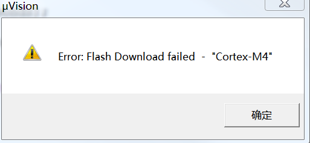

# DAPLink User Guide

The DAPLink provides drag and drop file programming for the BLE Nano 2 and the Blend 2 as well.

## Features

* ARM 32bit Cortex-M3
* 128KB FLASH, 20KB RAM
* VIN support 3v3 ~ 5v input
* VDD output 3v3
* MSC - drag-n-drop programming flash memory
* CDC - virtual com port for log, trace and terminal emulation
* HID - CMSIS-DAP compliant debug channel
* Support targets:
	- BLE Nano (nRF51822)
	- BLE Nano 2 (nRF52832)

## Pinout

## Driver Installation (Windows only)

For Windows 10, you do not need the driver.

For others, please refer to this [https://developer.mbed.org/handbook/Windows-serial-configuration](https://developer.mbed.org/handbook/Windows-serial-configuration "DAPLink_Windows_Driver")

After installing driver, will see:

## Update interface firmware

Pressing button and connecting to PC, the driver ***"MAINTENANCE"*** will appeare.Drag the interface firmware(.bin file) into the driver, re-connected to PC.

The firmware can be found in this folder: [Interface Firmware for BLE Nano 2](../daplink)

## Using DAPLink on Keil 5 IDE

Open the Options, select ***"CMSIS-DAP Debugger"***.

Select ***"SW"*** interface, 

Change the size of ***"RAM for Algorithm"*** and add ***"Programming Algorithm"***.

Clink OK, then you could use Keil5 to upload and debug.

## FAQ

 * Flash download failed - "Cortex-M4"
    
    When the nRF52 has softdevice, downloading the application will happen this problem.
	

    You need to eraseall the nRF52 flash.Drag the nRF52832_EraseChip.hex to the driver(DAPLink) to erase chip.Then you can download application through Keil5 IDE.
    
    [Linker : nRF52832_EraseChip.hex](https://github.com/redbear/nRF5x/tree/master/nRF52/test_firmware)

## More Information

 * [Official mbed DAPLink webpage](https://github.com/mbedmicro/DAPLink "mbed-DAPLink")
