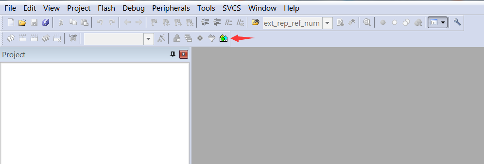
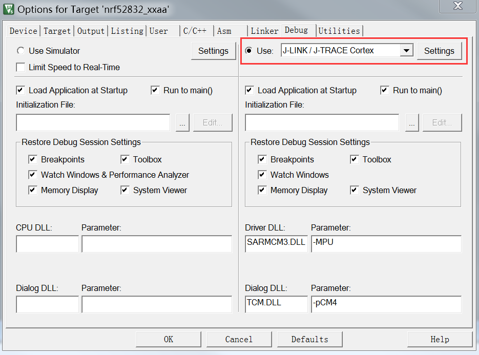

# Nordic SDK User Guide

This document introduces how to use the Nordic SDK12 with board nRF52832. Nordic SDK supports Keil 5.x, GCC and Eclipse development. Here, we will only instroduce the development using Keil 5.x IDE.

## Development of KEIL 5.xx IDE

### 1. Download Keil5.xx and install

 * Download [MDK-ARM](https://www.keil.com/download/product/ "MDK-ARM").

### 2. Download SDK

 * Download SDK from Nordic Official site:

    [http://www.nordicsemi.com/eng/Products/Bluetooth-low-energy/nRF52832](http://www.nordicsemi.com/eng/Products/Bluetooth-low-energy/nRF52832 "Download Nordic SDK")

 * Find ***SOFTWARE DEVELOPMENT KIT***, select ***nRF5-SDK-zip*** and download.

    

### 3. Installing pack of NordicSemiconductor

 * Open ***Keil uVision 5***, click ***pack install***:

    

 * Under the list of ***Devices***, select ***Nordic Semiconductor/nRF52 Serials/nRF52832-xxAA***, then installing ***NordicSemiconductor:nRF_DeviceFamillyPack***.

    

 * After installing the pack successfully, click ***Project->Open Project...*** to open a exist project. For example, here will open example ***"ble-app-hrs"***(nRF5-SDK-12.0.0\examples\ble_peripheral\ble-app-hrs\pca10040\s132\arm5-no-packs). Then you can compile this example.

    

    

### 4. Configuration for Compiling and uploading

 * If use softdevice-s132-3.0, IROM should start at 0x1F000,IRAM is defined according to the actual used:

    

    If not use softdevice, config IROM and IRAM as:

    

 * Click ***Debug***, select ***J-LINK/J-TRACE Cortex***(It is assumed that use nRF52DK board, the interface is JLink):
    
    

 * Then click ***settings***, configurate the ***Programming Algorithm***:

    

    

 * After these steps, now you can compile and upload the project!

### 5. DAPLink Configuration
 
 * Please refer to the [DAPLink User Guide](DAPLink_User_Guide.md).

## Development with eclipse IDE and GCC

 * Please refer to [https://devzone.nordicsemi.com/tutorials/7/](https://devzone.nordicsemi.com/tutorials/7/ "Development with GCC and Eclipse")
 
 