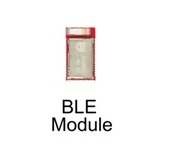
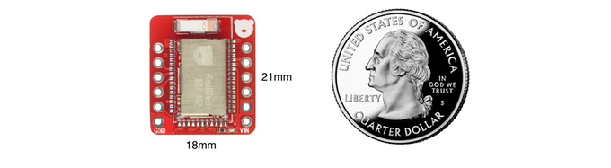
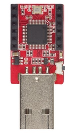

# RedBear nRF52832

## BLE Module (MB-N2)

### Features

* Nordic Semiconductor nRF52832 SoC
    * ARM Cortex-M4F (32-bit, @64MHz)
    * Bluetooth 4.2 certified and 5.0 ready (BLE only)
    	* Bluetooth QDID: [91904](https://www.bluetooth.org/tpg/QLI_viewQDL.cfm?qid=33543)
    * NFC
    * 64KB SRAM
    * 512KB Flash
    * FPU
    * DSP
* Onboard Chip Antenna
* Certifications
    * CE
    * FCC
    * [BQB](https://www.bluetooth.org/tpg/QLI_viewQDL.cfm?qid=33543)
* Total 32-I/O, includes
    * 1 x UART
    * 2 x I2C
    * 2 x SPI
    * Max. 12 PWM
    * Max. 8 ADC
* Physical Dimensions
    * 10 mm x 18 mm
* Operation Voltage
    * 1.8V to 3.6V

### Applications

* Internet of Things (IoT)
* Wearables
* SmartHome sensors
* Connected white goods
* Computer peripherals
* Voice-command smart remotes
* A4WP ‘Rezence’ wireless charging
* Beacons
* Sports and fitness sensors and hubs
* Connected health products
* Smart watches
* RC Toys
* Interactive games
* Building automation and sensor networks

### Pinout

### Datasheet

* [MB-N2_Datasheet](../datasheet/MB-N2_Datasheet.pdf)

### Eagle library

* [Eagle lib](../pcb/eagle)

## BLE Nano 2

### Features

* Build around the RedBear MB-N2
* World smallest Bluetooth 5.0 development board (BLE only)
* User Interface
    * 1 x Programmable LED (L, also connected to Pin 13)
* I/O Capabilities
    * 12 x Digital I/O (an I/O occupied for the onboard LED)
    * 12 x PWM (a PWM occupied for the onboard LED)
    * 7 x ADC
* Peripherals
    * BLE
    * NFC
    * 1 x UART (connected to the USB interface chip by default)
    * 2 x SPI
    * 2 x I2C
* Physical Dimensions
    * 18 mm x 21 mm
* Input Voltage
    * VIN: 3.3V to 13V
    * VDD: 1.8V to 3.3V
* Operation Voltage
    * 1.8V - 3.6V
* Development Platforms:
    * Arduino IDE (Wiring / C++)
    * Espruino Web IDE (JavaScript)
    * nRF52 SDK with Keil or GCC (Native C)
    * ARM mbed Web IDE (C++)

### Pinout

### Schematic

* [Nano2.0 Schematic](../pcb/schematic/Nano V2.0 SCH 20161102.pdf)

## DAPLink

### Features

* MCU
    * GD32F103CBT6
* User Interface
    * Status LED
    * Button
    * UART
    * USB
    * Serial Wire Debug for target MCU 
* Supported Target Boards
    * BLE Nano
    * BLE Nano 2
* USB Interface
    * Serial Debug
    * CMSIS-DAP
    * Mass Storage (Drag & Drop programming)
* Input Voltage
    * USB 5V
* Operation Voltage
    * 3.3V

### Schematic

* [DAPLink Schematic](../pcb/schematic/DAPLink V1.5 SCH 20161230.pdf)

## Blend 2

### Features

* Build around the RedBear MB-N2
* Arduino Form Factor
    * 3rd-party Arduino UNO Shields compatible
* User Interface
    * 3 x Status LED
    * 1 x Programmable LED (L, also connected to Pin 13)
    * 1 x Reset Button
* I/O Capabilities
    * 26 x Digital I/O
    * 8 x PWM
    * 6 x ADC
* DAPLink USB Interface
   * Serial Debug
   * CMSIS-DAP
   * Mass Storage (Drag & Drop programming)
* Peripherals
    * BLE
    * NFC
    * 1 x UART (connected to the USB interface chip by default)
    * 2 x SPI
    * 2 x I2C
    * 1 x CR2032 battery holder
    * 2 x Grove module connectors
    * Serial Wire Debug (SWD) port
* Physical Dimensions
    * 69 mm x 53 mm
* Input Voltage
    * VIN: 6.6V to 12V
    * DC Jack: 6.6V to 12V
    * USB: 5V
* Operation Voltage
    * 3.3V
* Development Platforms:
    * Arduino IDE (Wiring / C++)
    * Espruino Web IDE (JavaScript)
    * nRF52 SDK with Keil or GCC (Native C)
    * ARM mbed Web IDE (C++)

### Pinout

### Schematic

* [Blend 2 Schematic](../pcb/schematic/Blend v2.0 SCH 20161102.pdf)

## Resources

* [nRF52832 Datasheet]()

