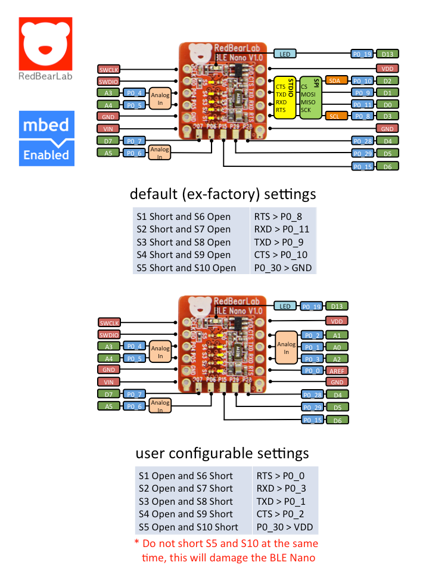

# nRF51822

The nRF51822 is a powerful, highly flexible multiprotocol SoC ideally suited for Bluetooth® low energy and 2.4GHz ultra low-power wireless applications. The nRF51822 is built around a 32-bit ARM® Cortex™ M0 CPU with 256kB/128kB flash + 32kB/16kB RAM for improved application performance.. You can read all [nRF51822 advanced features](https://www.nordicsemi.com/eng/Products/Bluetooth-low-energy/nRF51822) on Nordic's website.

## BLE Nano

The BLE Nano is compatible to Arduino (but not 100%) and allows you to use the Arduino IDE for development. Also, it supports mbed online development.

For mbed, please visit, [mbed for BLE Nano](https://developer.mbed.org/platforms/RedBearLab-BLE-Nano/).

It targets for makers, engineers and students to develop low power Internet-Of-Things (IoT) projects/prototypes quickly and easily.

## RBL_nRF51822

RBL nRF51822 is an integrated "ARM + BLE 4.0" development board. It contains a Nordic nRF51822 SoC (ARM Cortex-M0 with BLE) and a Freescale MK20DX MCU (ARM Cortex-M4).

The MK20DX MCU acts as an interface chip that adds USB to the board so that user can upload firmware to the target nRF51822 chip. For more about the USB interface, please see the [USB-IF](../USB-IF) folder.

Also, it supports [mbed](https://developer.mbed.org/platforms/RedBearLab-nRF51822/) for online development. 

This board targets for makers, engineers and students to develop low power Internet-Of-Things (IoT) projects/prototypes quickly and easily.

## Interface board

The interface board (MK20 or DAPLink) provides the functions for software development such as downloading firmware.

To update the interface firmware, please refer to the [USB-IF](../USB-IF) folder.

## Resources
For Arduino, please refer to this repo.: [nRF51822-Arduino](https://github.com/RedBear/nRF5x/tree/develop/nRF51822/arduino/)

For more information, please visit:
[http://redbearlab.com/blenano](http://redbearlab.com/blenano)

