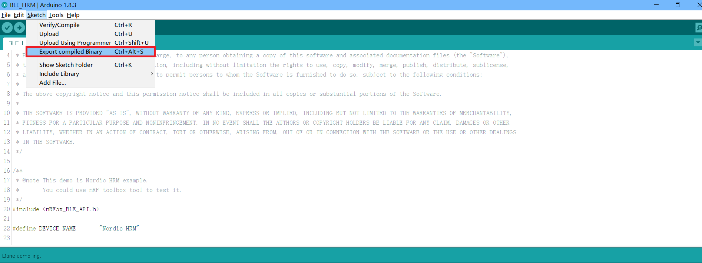
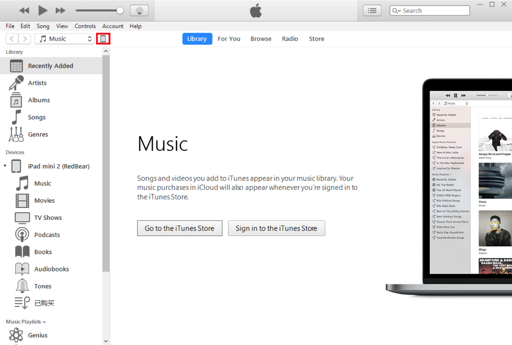
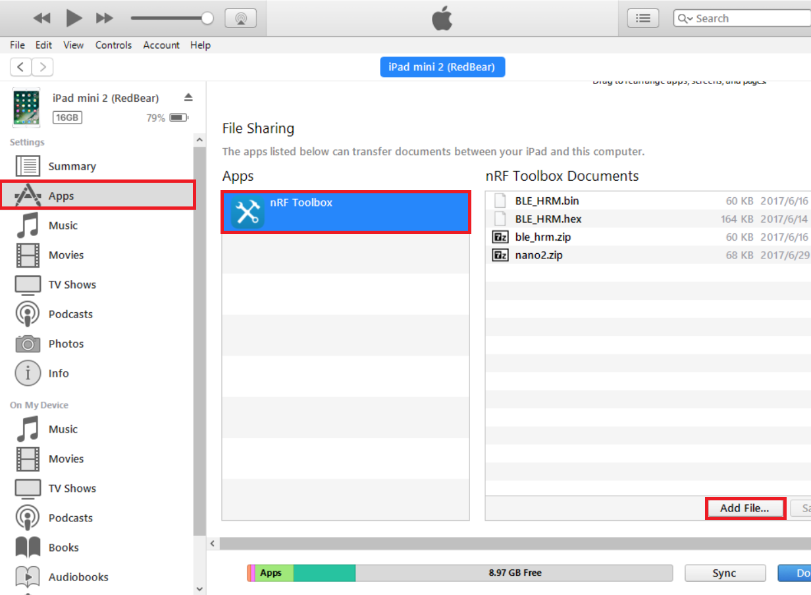
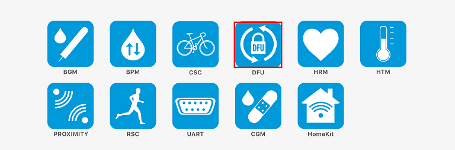
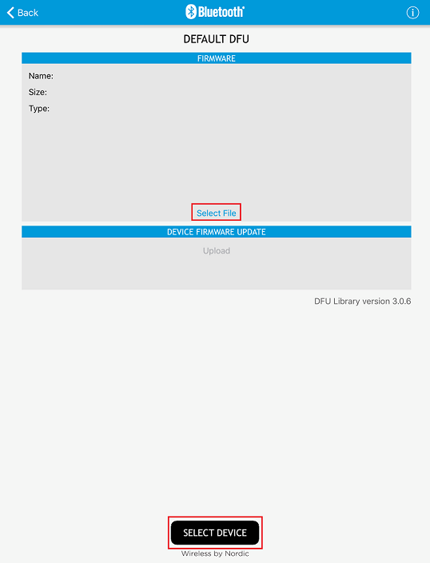
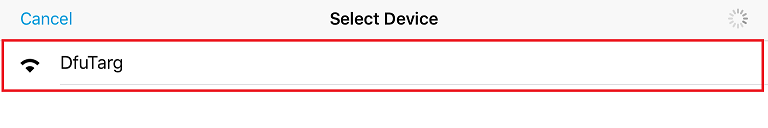
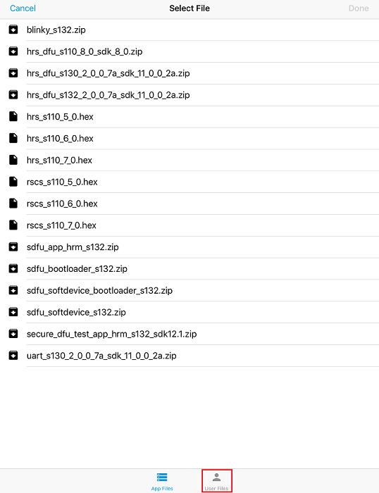
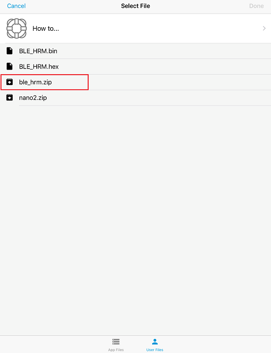
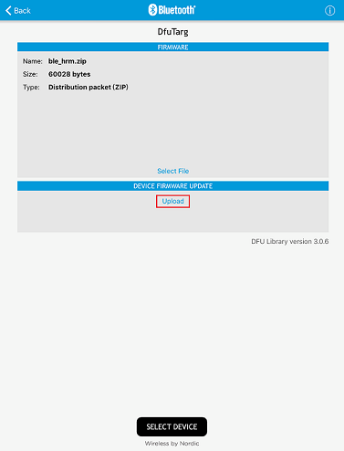
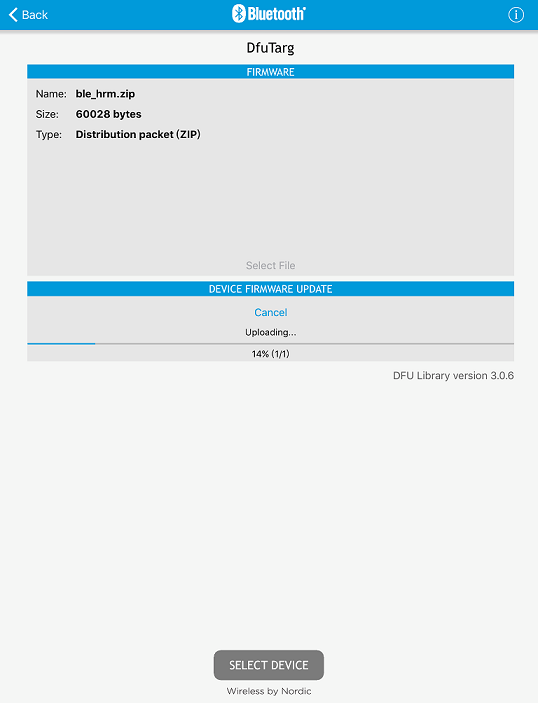

# DFU User Guide

For Blend2 and Nano2

***

## Bootloader Version

* SoftdeviceS132-2.0-SDK11-Bootloader-20161221.hex

## Features

*  This bootloader is made up of softdevice, DFU_bootloader.
*  Softdevice version : S132_2.0.
*  DFU bootloader is based on DFU example in nordic SDK11.0.
*  Memory range of bootloader : 0x0007A000~0x0007F000

##Step1: Enter DFU mode

In DFU mode, LED should blink in 100ms.If no any operations, will exit after 30s.

### 1. Booloader Button
&nbsp; &nbsp; Bootloader Button is P0_04.Connecting to GND, then power on or reset.

### 2. DFU service
&nbsp; &nbsp; Add dfu service to application(Refer to official examples).

##Step2: Export compiled binary file from Arduino program

Arduino IDE Hot Key: Ctrl + Alt + S or Click Arduino IDE menu Sketch==>Export compiled Binary

##Step3: Create .zip

### Tools

&nbsp; &nbsp; **nrfutil.exe**. Get this by installing the **"Master Control Panel"**.

### Command Line

    nrfutil.exe dfu genpkg --application [app_file_name].hex --application-version   [app_version] --softdevice [sd_file_name].hex --bootloader [bootloader_name].hex --    dev-type [dev-type] --dev-revision [dev-revision] --sd-req [supported-softdevice-ids] [name of distribution packet].zip

Note : app_version use default 0xFFFFFFFF,dev-type use default 0xFFFF, dev-revision use default 0xFFFF, supported-softdevice-ids use default 0xFFFE.

e.g. : create a application zip

    nrfutil.exe dfu genpkg --application D:\Blink.hex --application-version 0xFFFFFFFF --dev-type 0xFFFF --dev-revision 0xFFFF --sd-req 0xFFFE D:\Blink.zip

e.g. : create softdevice+bootloader zip

    nrfutil.exe dfu genpkg --application-version 0xFFFFFFFF --softdevice D:\softdevice.hex --bootloader D:\bootloader.hex --dev-type 0xFFFF --dev-revision 0xFFFF --sd-req 0xFFFE D:\Softdevice_bootloader.zip

##Step4: Copy the upgrade package to the nRF Toolbox App for Ipad or Iphone

##Step5: OTA

###1.Open nRF Toolbox  App and select DFU function.

###2.Select File and Select Device

- Select Device

- Select File

 

###3.Upload

