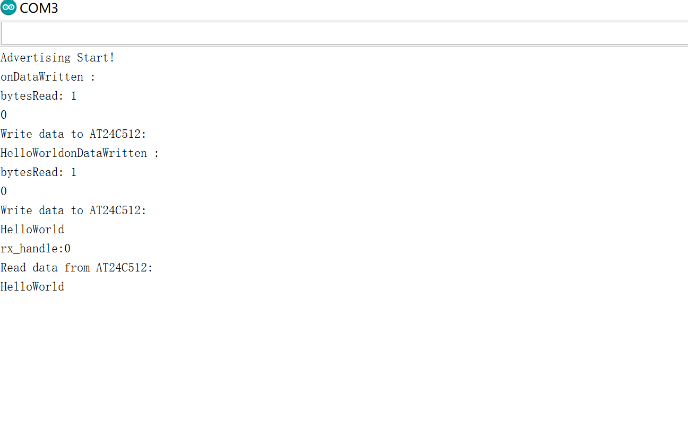
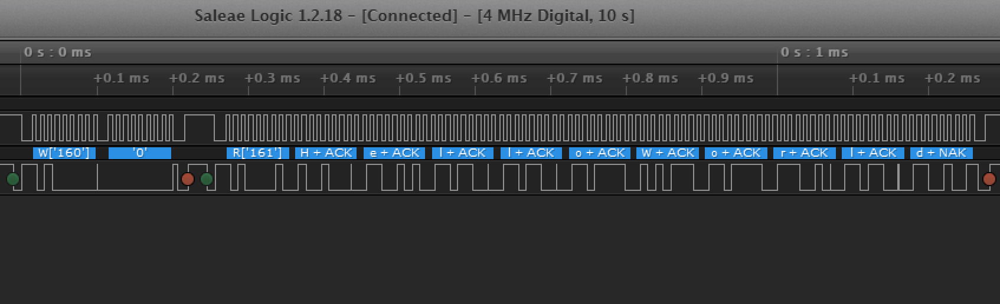

# I2C GUIDE

This is a guide for I2C with BLE control. You can use BLE Nano 2 to write and read the flash of [AT24C04](http://www.waveshare.net/w/upload/5/54/AT24C04B-08B.PDF) following it.

## REQUIREMENTS
* [Arduino](./Arduino_Board_Package_Installation_Guide.md)
* [nRF52 Board Package](./Arduino_Board_Package_Installation_Guide.md)
* [Daplink driver](./DAPLink_User_Guide.md)
* [BLE Nano 2](https://redbear.cc/product/ble-nano-kit-2.html)
* [DAPlink](https://redbear.cc/product/ble-nano-kit-2.html)
* AT24C04 EEPROM

## STEPS
Before you start this tutorial, you should have started [Arduino Installation Guide](./Arduino_Board_Package_Installation_Guide.md). We assume that you have installed Arduino IDE 1.8.0 or above on your computer and the nRF52 board package.

1. Connect the VDD, GND, SWCLK, SWDIO, RXD, TXD pin on DAPlink to Nano2. 
	
	Connect the SCL, SDA, VCC, GND on AT24C04 to the pin D2, D3, VDD, GND on nano2.
	
	Connect DAPlink to PC.

	
2. Start Arduino IDE.
3. After installing nRF52 board package successfully, navigate to "Tools > Board", you need to now select board、port and programmer as below:
	
	
4. Then you can put the source code to Arduino IDE and have it uploaded. This sketch writes "Helloworld" to AT24C04 and read content in flash with BLE control. 
	
	It mainly includes two functions: use BLEController which can be downloaded in APP store to write to characteristic1 and AT24C04_WriteBytes will be called to write "HelloWorld" to flash then the data will be displayed in the serial monitor; send the address you want to read from flash and AT24C04_ReadBytes will be called then the data will be also displayed in the serial monitor.     

```cpp
/*
 * Copyright (c) 2016 RedBear
 *
 * Permission is hereby granted, free of charge, to any person obtaining a copy of this software and associated documentation files (the "Software"),
 * to deal in the Software without restriction, including without limitation the rights to use, copy, modify, merge, publish, distribute, sublicense,
 * and/or sell copies of the Software, and to permit persons to whom the Software is furnished to do so, subject to the following conditions:
 *
 * The above copyright notice and this permission notice shall be included in all copies or substantial portions of the Software.
 *
 * THE SOFTWARE IS PROVIDED "AS IS", WITHOUT WARRANTY OF ANY KIND, EXPRESS OR IMPLIED, INCLUDING BUT NOT LIMITED TO THE WARRANTIES OF MERCHANTABILITY,
 * FITNESS FOR A PARTICULAR PURPOSE AND NONINFRINGEMENT. IN NO EVENT SHALL THE AUTHORS OR COPYRIGHT HOLDERS BE LIABLE FOR ANY CLAIM, DAMAGES OR OTHER
 * LIABILITY, WHETHER IN AN ACTION OF CONTRACT, TORT OR OTHERWISE, ARISING FROM, OUT OF OR IN CONNECTION WITH THE SOFTWARE OR THE USE OR OTHER DEALINGS
 * IN THE SOFTWARE.
 */
#include <nRF5x_BLE_API.h>
#include <Wire.h>

#define DEVICE_NAME            "BLE_Peripheral"
#define TXRX_BUF_LEN           20

#define DEV_ADDR  (0xA0>>1)

static uint8_t wt_data[10] = {'H', 'e', 'l', 'l', 'o', 'W', 'o', 'r', 'l', 'd'};
static uint8_t rd_data[10];
volatile uint8_t read_flag = 0;
volatile uint8_t write_flag = 0;
volatile uint8_t write_buf[TXRX_BUF_LEN];
volatile uint8_t read_buf[TXRX_BUF_LEN]={0};

BLE                            ble;
Timeout                        timeout;

static uint8_t rx_buf[TXRX_BUF_LEN];
static uint8_t rx_buf_num;
static uint8_t rx_state=0;

// The uuid of service and characteristics
static const uint8_t service1_uuid[]        = {0x71, 0x3D, 0, 0, 0x50, 0x3E, 0x4C, 0x75, 0xBA, 0x94, 0x31, 0x48, 0xF1, 0x8D, 0x94, 0x1E};
static const uint8_t service1_tx_uuid[]     = {0x71, 0x3D, 0, 3, 0x50, 0x3E, 0x4C, 0x75, 0xBA, 0x94, 0x31, 0x48, 0xF1, 0x8D, 0x94, 0x1E};
static const uint8_t service1_rx_uuid[]     = {0x71, 0x3D, 0, 2, 0x50, 0x3E, 0x4C, 0x75, 0xBA, 0x94, 0x31, 0x48, 0xF1, 0x8D, 0x94, 0x1E};
static const uint8_t uart_base_uuid_rev[]   = {0x1E, 0x94, 0x8D, 0xF1, 0x48, 0x31, 0x94, 0xBA, 0x75, 0x4C, 0x3E, 0x50, 0, 0, 0x3D, 0x71};

uint8_t tx_value[TXRX_BUF_LEN] = {0,};
uint8_t rx_value[TXRX_BUF_LEN] = {0,};

// Initialize value of chars
GattCharacteristic  characteristic1(service1_tx_uuid, tx_value, 1, TXRX_BUF_LEN, GattCharacteristic::BLE_GATT_CHAR_PROPERTIES_WRITE | GattCharacteristic::BLE_GATT_CHAR_PROPERTIES_WRITE_WITHOUT_RESPONSE );
GattCharacteristic  characteristic2(service1_rx_uuid, rx_value, 1, TXRX_BUF_LEN, GattCharacteristic::BLE_GATT_CHAR_PROPERTIES_NOTIFY);
GattCharacteristic *uartChars[] = {&characteristic1, &characteristic2};
GattService         uartService(service1_uuid, uartChars, sizeof(uartChars) / sizeof(GattCharacteristic *));

void AT24C04_WriteBytes(uint16_t addr, uint8_t *pbuf, uint16_t len) {
  Wire.beginTransmission(DEV_ADDR);
  //Wire.write((uint8_t)addr>>8);
  Wire.write((uint8_t)addr);
  Wire.write(pbuf, len);
  Wire.endTransmission();
}

void AT24C04_ReadBytes(uint16_t addr, uint8_t *pbuf, uint16_t len) {
  Wire.beginTransmission(DEV_ADDR);
  //Wire.write((uint8_t)addr>>8);
  Wire.write((uint8_t)addr);
  Wire.endTransmission();

  Wire.requestFrom(DEV_ADDR,len);
  while( Wire.available() > 0 ) {
    *pbuf = Wire.read();
    pbuf++;
  }
}

void disconnectionCallBack(const Gap::DisconnectionCallbackParams_t *params) {
  Serial.println("Disconnected!");
  Serial.println("Restarting the advertising process");
  ble.startAdvertising();
}

void gattServerWriteCallBack(const GattWriteCallbackParams *Handler) {
  uint8_t buf[TXRX_BUF_LEN];
  uint8_t index;
  uint16_t bytesRead = TXRX_BUF_LEN;

  Serial.println("onDataWritten : ");
  if (Handler->handle == characteristic1.getValueAttribute().getHandle()) {
    ble.readCharacteristicValue(characteristic1.getValueAttribute().getHandle(), buf, &bytesRead);
    Serial.print("bytesRead: ");
    Serial.println(bytesRead, HEX);
    for(index=0; index<bytesRead; index++) {
      Serial.write(buf[index]);
    }
    Serial.println("");
   
    write_buf[0] = buf[0];
    write_flag = 1;
  }
}

void m_uart_rx_handle() {   //update characteristic data
  ble.updateCharacteristicValue(characteristic2.getValueAttribute().getHandle(), rx_buf, rx_buf_num);
  read_flag = 1;
  Serial.print("\nrx_handle:");
  Serial.write(rx_buf, 20);
  read_buf[0] = rx_buf[0];
  memset(rx_buf, 0x00,20);
  rx_state = 0;
}

void uart_handle(uint32_t id, SerialIrq event) {   /* Serial rx IRQ */
  if(event == RxIrq) {
    if(rx_state == 0) {
      rx_state = 1;
      timeout.attach_us(m_uart_rx_handle, 100000);
      rx_buf_num=0;
    }
    while(Serial.available()) {
      if(rx_buf_num < 20) {
        rx_buf[rx_buf_num] = Serial.read();
        rx_buf_num++;
      }
      else {
        Serial.read();
      }
    }
  }
}

void setup() {
  // put your setup code here, to run once
  Serial.begin(9600);
  Serial.attach(uart_handle);
  Wire.begin();
  ble.init();
  ble.onDisconnection(disconnectionCallBack);
  ble.onDataWritten(gattServerWriteCallBack);

  // setup adv_data and srp_data
  ble.accumulateAdvertisingPayload(GapAdvertisingData::BREDR_NOT_SUPPORTED);
  ble.accumulateAdvertisingPayload(GapAdvertisingData::SHORTENED_LOCAL_NAME,
                                   (const uint8_t *)"TXRX", sizeof("TXRX") - 1);
  ble.accumulateAdvertisingPayload(GapAdvertisingData::COMPLETE_LIST_128BIT_SERVICE_IDS,
                                   (const uint8_t *)uart_base_uuid_rev, sizeof(uart_base_uuid_rev));
  // set adv_type
  ble.setAdvertisingType(GapAdvertisingParams::ADV_CONNECTABLE_UNDIRECTED);
  // add service
  ble.addService(uartService);
  // set device name
  ble.setDeviceName((const uint8_t *)"Simple Chat");
  // set tx power,valid values are -40, -20, -16, -12, -8, -4, 0, 4
  ble.setTxPower(4);
  // set adv_interval, 100ms in multiples of 0.625ms.
  ble.setAdvertisingInterval(160);
  // set adv_timeout, in seconds
  ble.setAdvertisingTimeout(0);
  // start advertising
  ble.startAdvertising();
  Serial.println("Advertising Start!");
}

void loop() {
    if(read_flag == 1)
    {
      Serial.println("Read data from AT24C512: ");
      AT24C04_ReadBytes((uint16_t)atoi((char*)read_buf), rd_data, 10);
      Serial.write(rd_data, 10);
      read_flag = 0;
    }
    if(write_flag == 1)
    {
      Serial.println("Write data to AT24C512: ");
      write_flag = 0;
      AT24C04_WriteBytes((uint16_t)(atoi((char*)write_buf)), wt_data, 10);     
      Serial.write(wt_data, 10); 
    }
    ble.waitForEvent();
}

```

After successfully uploaded,you can open the serial monitor in the top right side in the Arduino window and get the log as below. You can see the process of writing address of 0 "HelloWorld" and reading "HelloWorld" from that address. 



## Option

If you catch the sequence chart using logic analyzer, you will see the sequence of writing address of 0 "HelloWorld" and reading "HelloWorld" from that address.


 	  


  