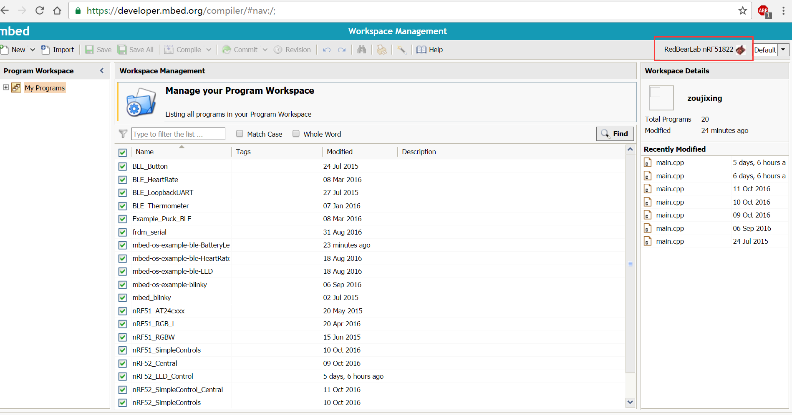
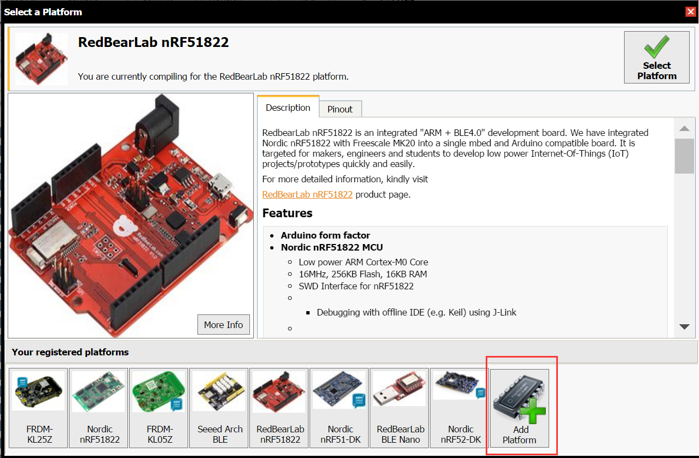
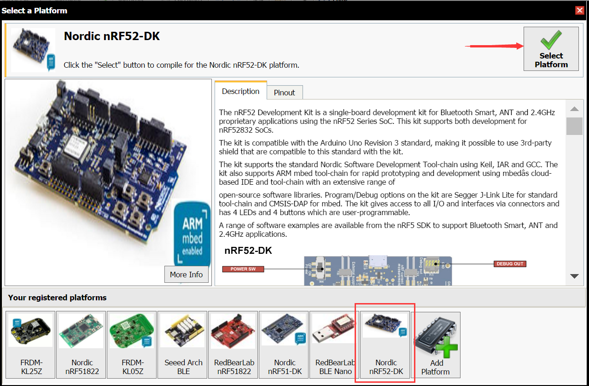

# MBED Eddystone User Guide

This document introduces the development of RedBear Blend 2.0 and BLE Nano 2.0 using the **mbed Online IDE**.

We are submitting the information of Blend 2.0 and Nano 2.0 to mbed platform for approval, here we will use the nRF52DK to instead of Blend 2.0 and it has the similar pinout as nRF52DK.

### 1. Select target platform

 * Sign into mbed website, go to **Workspace Management** page. Click on the red area to select new platform.
    
    

 * In the select platform window, click **Add Platform**.

    

 * Select nRF52DK board:

    

 * Click **Add to your mbed Compiler**:

    

 * Then nRF52DK will exist in your board list, Click **Select Platform**, now you will compile the source code with nRF52DK board. 

    

    

### 2. Inport Eddystone programs

 * Click **Import** then Click **click here**:

    

 * Add Source URL: https://developer.mbed.org/teams/Bluetooth-Low-Energy/code/BLE_EddystoneBeacon_Service/, then Click Import:

    

    

### 3. Compilling programs

 * Select example **BLE_EddystoneBeacon_Service**, click **Compile**:

    

 * When the compilation is complete, the **BLE_EddystoneBeacon_Service_NRF52_DK.hex** will generate.

### 4. Uploading firmware

 * Connecting BLE Nano2 to PC, then a driver **DAPLink** will appear. Drag hex file **BLE_EddystoneBeacon_Service_NRF52_DK.hex** to this driver.Then Eddystone will running.

    

