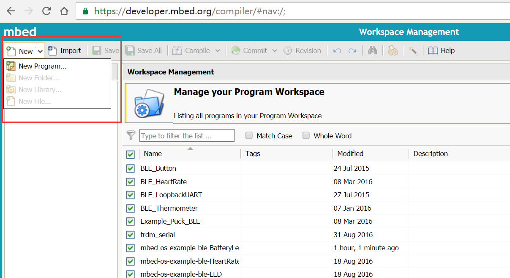
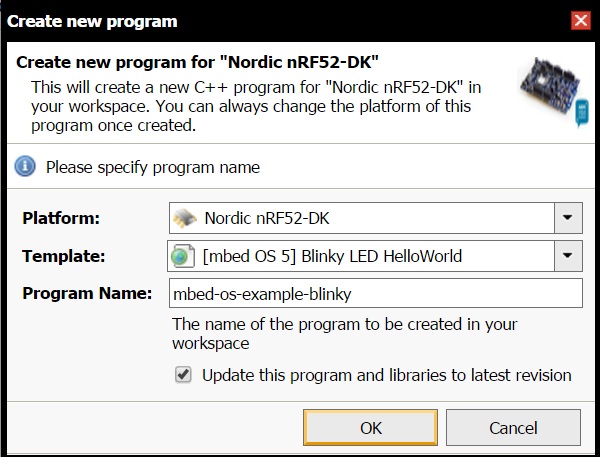
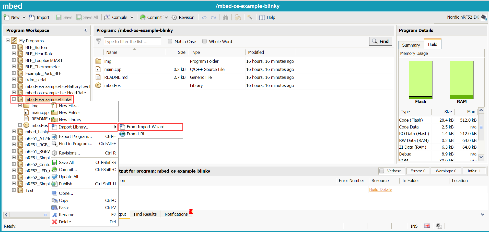
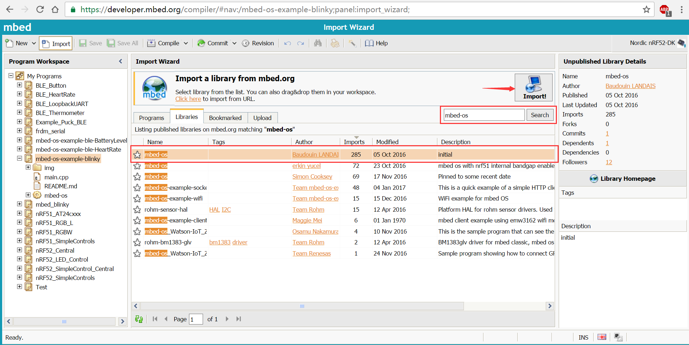
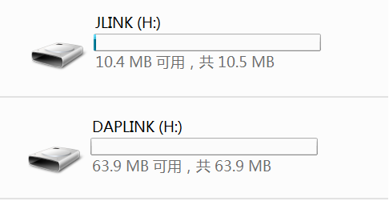

# MBED IDE User Guide

This document introduces the development of RedBear Blend 2.0 and BLE Nano 2.0 using the **mbed Online IDE**.

We are submitting the information of Blend 2.0 and Nano 2.0 to mbed platform for approval, here we will use the nRF52DK to instead of Blend 2.0 and it has the similar pinout as nRF52DK.

### 1. Register mbed account

* Here we assume that you already have the mbed account.

### 2. Select target platform

 * Sign into mbed website, go to **Workspace Management** page. Click on the red area to select new platform.
    
    

 * In the select platform window, click **Add Platform**.

    

 * Select nRF52DK board:

    

 * Click **Add to your mbed Compiler**:

    

 * Then nRF52DK will exist in your board list, Click **Select Platform**, now you will compile the source code with nRF52DK board. 

    

    

### 3. Add official programs

 * Click **New->New Program...**:

    

 * Add example **Blinky LED HelloWorld**, Click Ok:

    

    

### 4. Add a library

 * Right-click the program which you want to add library, select **Import Library...->From Import Wizard...**.

    

 * At **Import Wizard** page, type the name of the library, click **search**.

    

 * Select a library, then click **Import**.

    

 * Make sure your selection.Then this libary will be included in the program.

    

### 5. Compilling programs

 * Select example **Blinky LED HelloWorld**, click **Compile**:

    

 * When the compilation is complete, the **mbed-os-example-blinky-NRF52-DK.hex** will generate.

### 6. Uploading firmware

 * Connecting nRF52DK(or Blend2.0) to PC, then a driver **JLINK** or **DAPLink** will appear. Drag hex file **mbed-os-example-blinky-NRF52-DK.hex** to this driver.Then nRF52DK's LED1 will flash every second.

    

